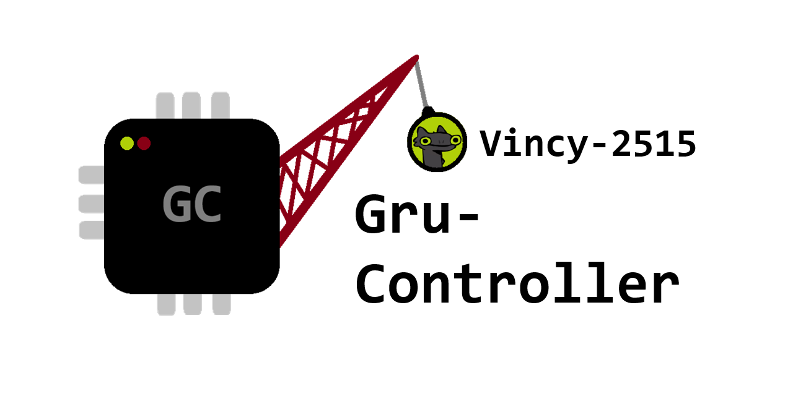

---

    
    &nbsp;&nbsp;
    
    &nbsp;&nbsp;

Gru-Controller è uno script in Arduino che ho scritto su PlatformIO per il controllo del modellino di una gru, e comprende: 
- la gestione di una connessione BLE (Bluetooth Low Energy); 
- la gestione di comandi inviati dal dispositivo centrale;
- la gestione di componenti hardware come: motorini, led e la memoria integrata EEPROM; 
- il tutto accompagnato da un dettagliato sistema di logging basato su tre livelli principali (INFO, WARNING, ERROR).

---

[Clicca qui per accedere alla guida.](GUIDE.md)

